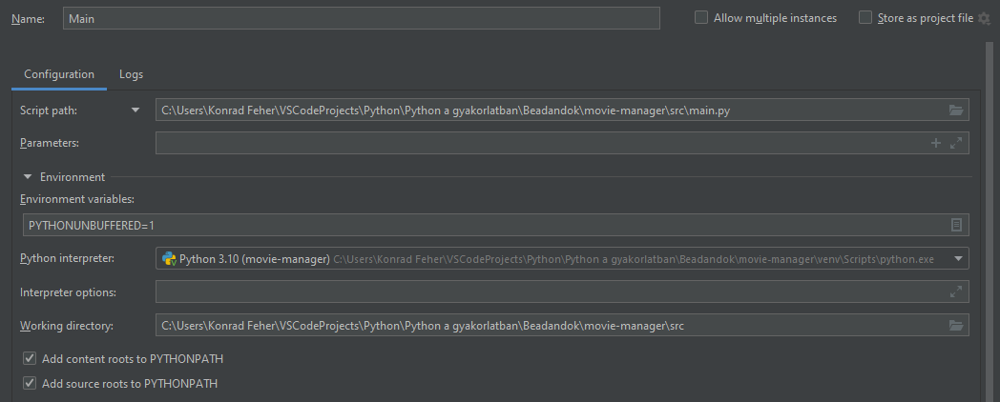

# movie-manager

Python desktop app project for a university Python course.  
A small Tkinter desktop application that provides us with movie recommendations, based on TheMovieDB API.  
Currently only using a local SQLite3 database for user data for brevity's sake.  

Features (so far):  
- Registration and login 
- Search and browse movies
- Add movies to watchlist
- Mark movies as watched
- View recommendations
- View similar movies

## Installation

All dependencies can be found in the `requirements.txt` file.  
We can run `pip install -r requirements.txt` to install them.  

We can run main.py to run the program, with this setup:

## Regarding testing

I have not managed to get Tkinter application testing to work, but I tested all else I could:  

## PEP and Flake8

Thr outputs of PEP and Flake8 (ignoring `E501 - line-too-long`):

